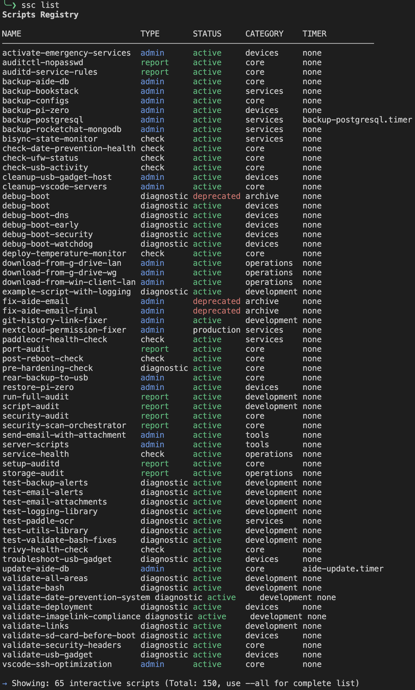

# Server Scripts CLI (ssc)

[](CHANGELOG.md)
[](LICENSE)
[](https://www.gnu.org/software/bash/)
[](README.md)
[](https://github.com/fidpa/server-scripts-cli/graphs/commit-activity)
[](docs/MANIFEST_SCHEMA.md)
[](CONTRIBUTING.md)

**YAML-based script management for shell and Python scripts**

Manage hundreds of scripts with a unified CLI: discover, execute, monitor, and validate via YAML manifest.

## About

- **Repository**: `server-scripts-cli`
- **Command**: `ssc` (short for **S**erver **Sc**ripts CLI)
- **Binary**: `ssc.sh` (source) → `ssc` (installed)

This documentation uses `ssc` throughout for brevity.

## Features

- **YAML Manifest-Based**: Auto-discover scripts via YAML front-matter extraction
- **4-Tier Type System**: Organize scripts by usage pattern (Interactive, One-time, Background, Internal)
- **Smart Defaults**: Shows only interactive scripts by default, use `--all` for complete list
- **Unified Interface**: Single CLI for list, run, info, status, logs, validate
- **systemd Integration**: Query service status, timers, and journalctl logs
- **Security**: Input validation, safe execution, requires_root detection
- **Advanced Filtering**: Category, type, status filters + search functionality
- **Zero Framework Lock-in**: Pure Bash + yq, no Python/Node dependencies

## Screenshot



*Example: `ssc list` shows 65 interactive scripts organized by type, status, category, and timer (150 total with `--all`)*

## Quick Start

```bash
# Clone repository
git clone https://github.com/fidpa/server-scripts-cli
cd server-scripts-cli

# Generate manifest from your scripts
./generate-manifest.sh

# List all scripts
./ssc.sh list

# Run a script
./ssc.sh run backup-example

# Show script details
./ssc.sh info monitoring-example
```

## Installation

### Automated Installation (Recommended)

```bash
# One-liner installation (adds alias to ~/.bashrc)
curl -sSL https://raw.githubusercontent.com/fidpa/server-scripts-cli/main/install.sh | bash

# Or with options:
./install.sh --local   # Alias in ~/.bashrc (default)
./install.sh --user    # Symlink to ~/.local/bin
./install.sh --system  # Install to /usr/local/bin (requires sudo)
```

### Manual Installation

<details>
<summary>Click to expand manual options</summary>

**Option 1: Local Repository (Alias)**
```bash
git clone https://github.com/fidpa/server-scripts-cli ~/server-scripts-cli
cd ~/server-scripts-cli
./generate-manifest.sh

# Add alias to ~/.bashrc
echo "alias ssc='~/server-scripts-cli/ssc.sh'" >> ~/.bashrc
source ~/.bashrc
```

**Option 2: System-Wide (Copy Binary)**
```bash
# Install binaries to /usr/local/bin
sudo cp ssc.sh /usr/local/bin/ssc
sudo cp generate-manifest.sh /usr/local/bin/
sudo chmod +x /usr/local/bin/{ssc,generate-manifest.sh}
```

**Option 3: User-Local (Symlink)**
```bash
# Symlink to ~/.local/bin (ensure it's in PATH)
mkdir -p ~/.local/bin
ln -s $(pwd)/ssc.sh ~/.local/bin/ssc
```

</details>

All options install the command as `ssc` for consistency.

## Commands

| Command | Purpose |
|---------|---------|
| `ssc list` | List scripts with filters (shows Interactive types by default) |
| `ssc list --all` | Show complete script list (all types) |
| `ssc run <name>` | Execute script by name |
| `ssc info <name>` | Show detailed script metadata |
| `ssc status` | Query systemd service status |
| `ssc logs <name>` | Show journalctl logs for script's service |
| `ssc validate` | Validate manifest integrity |
| `ssc generate` | Regenerate manifest from front-matter |

## YAML Front-Matter Schema

Add metadata to your scripts:

```bash
#!/bin/bash
# ---
# deployment: manual
# service: backup.service
# status: active
# type: admin
# requires_root: true
# ---
#
# Your script here
```

See [docs/MANIFEST_SCHEMA.md](docs/MANIFEST_SCHEMA.md) for complete schema reference.

## Requirements

- **Bash**: 4.0+
- **yq**: mikefarah/yq v4+ ([install](https://github.com/mikefarah/yq))
- **Optional**: systemd (for status/logs commands)

## Documentation

- [Documentation Index](docs/README.md) - All documentation
- [Setup Guide](docs/SETUP.md) - Installation, configuration, systemd integration
- [Manifest Schema](docs/MANIFEST_SCHEMA.md) - Complete YAML reference
- [Troubleshooting](docs/TROUBLESHOOTING.md) - Common issues

## Examples

See [examples/](examples/) for 4 ready-to-run demo scripts:
- `backup-example.sh` - Scheduled backup with root privileges
- `monitoring-example.sh` - System metrics collection
- `health-check.sh` - Service health validation
- `deploy-example.sh` - Deployment automation

## Contributing

Contributions are welcome! Please read our guidelines before submitting:

- [Contributing Guide](CONTRIBUTING.md) - How to contribute
- [Code of Conduct](CODE_OF_CONDUCT.md) - Community standards
- [Security Policy](SECURITY.md) - Reporting vulnerabilities

## License

MIT License - Copyright (c) 2025-2026 Marc Allgeier (fidpa)

See [LICENSE](LICENSE) for details.

## Author

Marc Allgeier ([@fidpa](https://github.com/fidpa))
